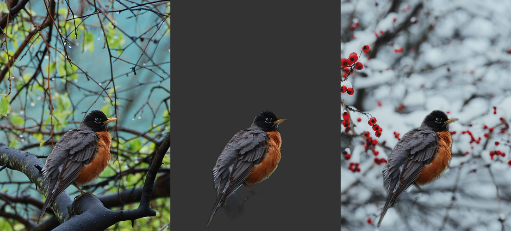

# [Background Removal](https://github.com/dusty-nv/jetson-inference/blob/master/docs/backgroundnet.md)

In this section, learn how to remove or replace the background of an image or video stream using a pre-trained AI model. Refer to [this guide](https://github.com/dusty-nv/jetson-inference/blob/master/docs/backgroundnet.md) to follow along.

## Image Background Removal

Ensure you are in the correct directory where the repository was built from source.

```bash
cd aarch64/bin
```

Remove the following image background.

```bash
./backgroundnet.py images/bird_0.jpg images/test/bird_mask.png
```

Replace the background with a new image.

```bash
./backgroundnet.py --replace=images/snow.jpg images/bird_0.jpg images/test/bird_replace.jpg
```



The output images will be saved in the `images/test` directory.

## Webcam Background Removal

Ensure your webcam is connected. The model may take several minutes to download and compile on first run.

```bash
./aarch64/bin/backgroundnet /dev/video0 # remove the background
```

> Note: Run these commands from the repository root after building from source.

Next | [Monocular Depth with DepthNet](Monocular_Depth.md)  
Previous | [Action Recognition](Action_Recognition.md)
