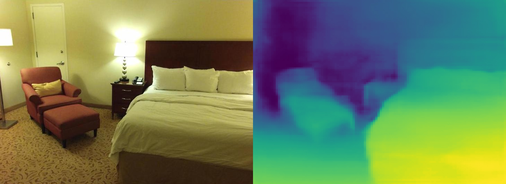

# [Monocular Depth with DepthNet](https://github.com/dusty-nv/jetson-inference/blob/master/docs/depthnet.md)

In this section, learn how to estimate depth from a image(s) using a pre-trained AI model. Refer to [this guide](https://github.com/dusty-nv/jetson-inference/blob/master/docs/depthnet.md) to follow along.

## Mono Depth on images

Ensure you are in the correct directory (`cd aarch64/bin`) before executing the command:

```bash
./depthnet.py "images/room_*.jpg" images/test/depth_room_%i.jpg
```



The output images will be saved in the `images/test` directory.

## Mono Depth from Webcam

Make sure your webcam is connected. The model may take several minutes to download and compile on first run.

```bash
./depthnet.py /dev/video0  # csi://0 if using MIPI CSI camera
```

## Summary

This model is valuable in robotics and autonomous vehicles, where understanding the environment is crucial. Refer to the guide for details on obtaining raw depth data.

Next | [Curriculum Home](../README.md)  
Previous | [Background Removal](Background_Removal.md)
