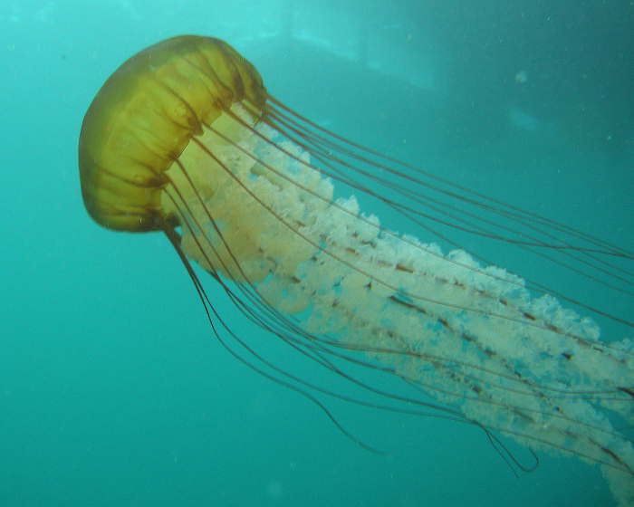
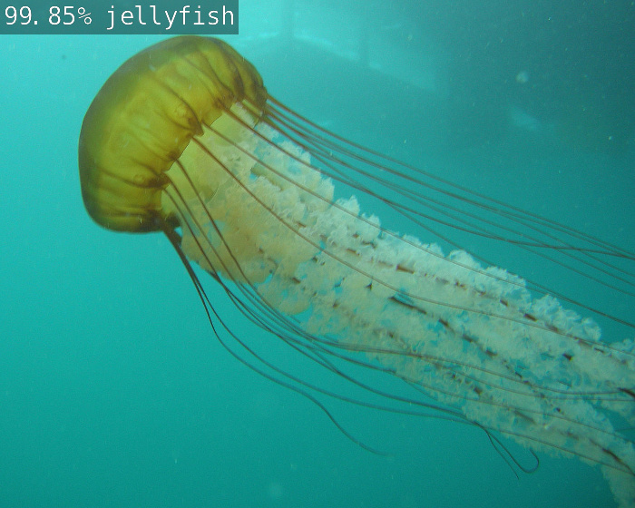
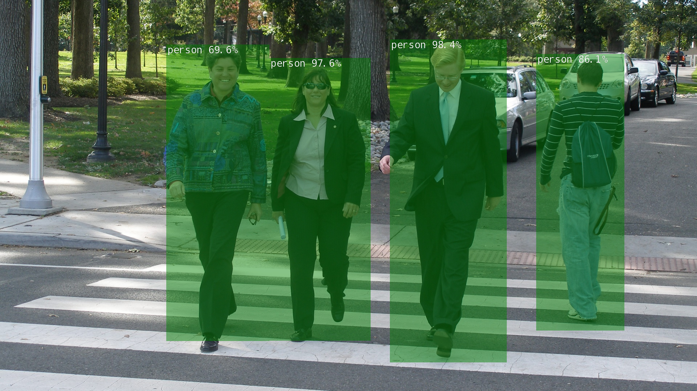

# [Running the Docker Container](https://github.com/dusty-nv/jetson-inference/blob/master/docs/aux-docker.md)

Docker is a way to navigate and run many of the pre-built models and applications in the Hello AI World repository. It simplifies dependency management and environment isolation. This is one of two ways to run projects and pre-built models in the Hello AI World repository. The other is to build from source.

We will continue with the Hello AI World repository and follow the [Running the Docker Container](https://github.com/dusty-nv/jetson-inference/blob/master/docs/aux-docker.md) guide to run some tests including:

## Launching the video viewer application

This allows us to test video feed from a webcam.

## Classify a jellyfish

Tests the imagenet application to classify an image.

## Detect objects in an image

Test the detectnet application to detect and label multiple objects in an image.

Next | [Building from Source](Building_Source.md)  
Previous | [Hello AI World Hello World](./README.md)
